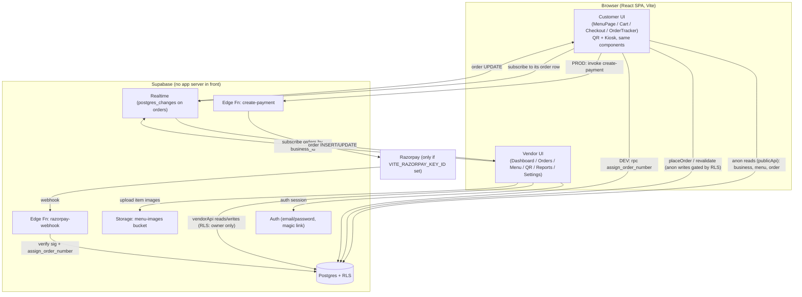
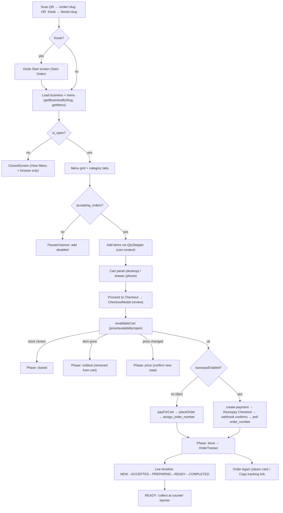
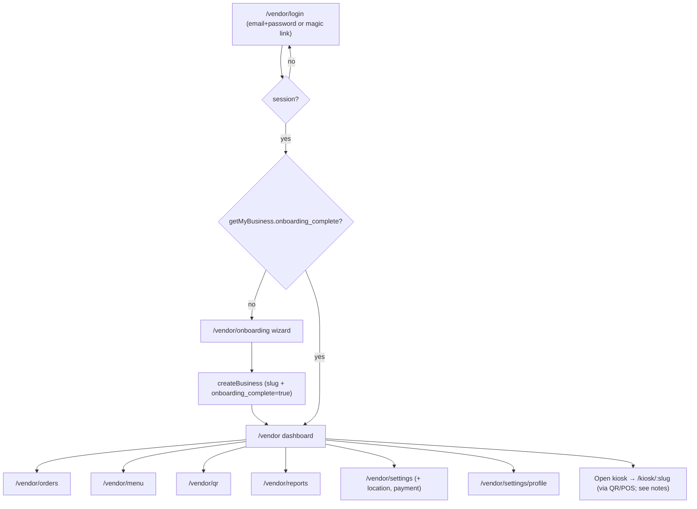
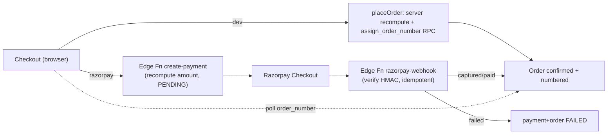
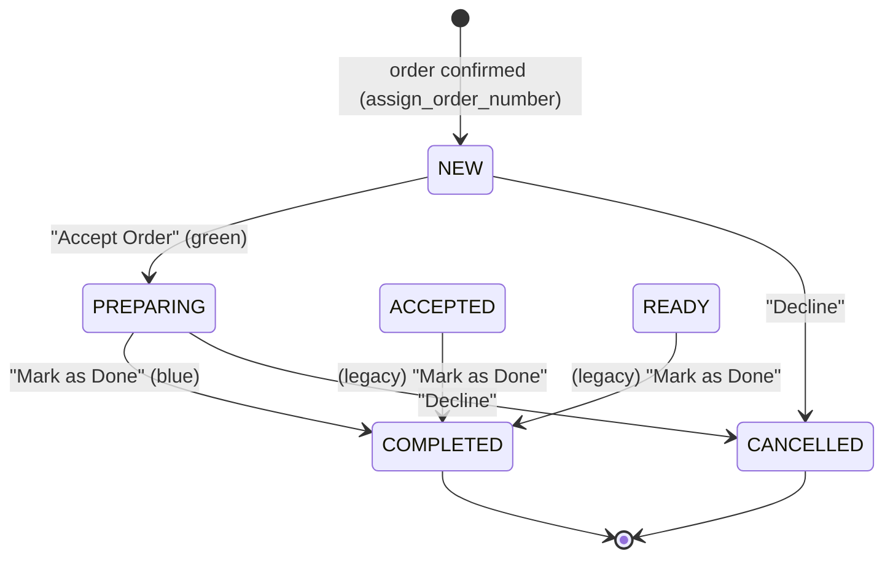
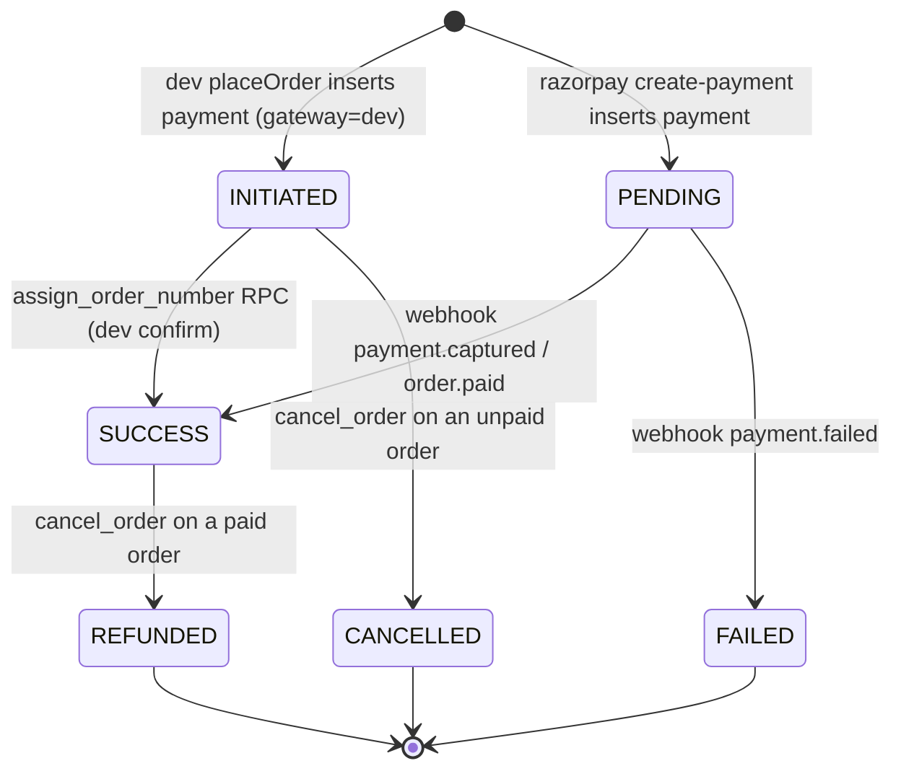
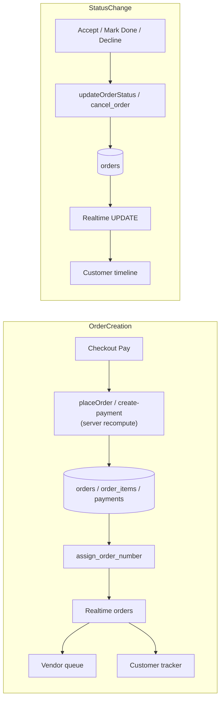

# ORDERLY — Current Project Audit

> Read-only audit of the Orderly codebase as it exists today. Every claim below is grounded in actual source files, SQL migrations, Edge Functions, or project documentation. Where the project cannot confirm something, it is explicitly stated as **"Cannot confirm from the current project."**
>
> This document describes **what is currently implemented**, not what should be built or changed.

---

## 1. Project Overview

| Aspect | Current implementation | Evidence |
|---|---|---|
| **Project name** | Orderly | `package.json` (`"name": "orderly"`), `index.html` title |
| **Project type** | Street-food self-service ordering + vendor POS (single-page web app) | `README.md`, `docs/00-overview.md` |
| **Development stage** | Working MVP that type-checks and builds clean (`npm run build` → exit 0). Core customer + vendor loops implemented. A few spec items are placeholders. | Build verified in this audit (exit 0) |
| **Frontend** | React 18.3 + TypeScript, bundled with Vite 6 | `package.json`, `vite.config.ts` |
| **Backend** | Supabase (no custom app server). Frontend talks **directly** to Supabase (Postgres + Auth + Realtime + Storage) via the JS client. Two Supabase **Edge Functions** (Deno) exist for Razorpay. | `src/lib/supabase.ts`, `supabase/functions/*` |
| **Database** | Supabase Postgres | `supabase/migrations/*.sql` |
| **Authentication** | Supabase Auth — **email + password** (primary) and **email magic link** (secondary). Phone OTP is NOT wired. | `src/lib/auth.ts`, `src/features/vendor/LoginPage.tsx` |
| **Payment system** | Two modes controlled by env var: **Dev auto-confirm** (default, no gateway) and **Razorpay** (when `VITE_RAZORPAY_KEY_ID` set). Razorpay flow uses two Edge Functions. | `src/lib/payments.ts`, `supabase/functions/*` |
| **Storage** | Supabase Storage bucket `menu-images` (public read, authenticated write) | `src/lib/vendorApi.ts → uploadMenuImage`, `supabase/migrations/0003_storage.sql` |
| **Realtime system** | Supabase Realtime (Postgres `postgres_changes`) on the `orders` table; publication also includes `order_items` and `items` | `src/hooks/useRealtimeOrders.ts`, `src/features/customer/OrderTracker.tsx`, `0002_rls_realtime.sql` |
| **Routing** | `react-router-dom` v6 (`createBrowserRouter`); vendor pages lazy-loaded | `src/app/router.tsx` |
| **Important libraries** | `@supabase/supabase-js` ^2.45, `react-router-dom` ^6.30, `qrcode` ^1.5 (QR generation), `react`/`react-dom` ^18.3 | `package.json` |
| **Charts** | Hand-written SVG charts, no charting dependency (`ComboChart`, `DonutChart`, `BarChart`) | `src/components/charts/*` |
| **Dev/build commands** | `npm run dev` (Vite dev server), `npm run build` (`tsc -b && vite build`), `npm run preview`, `npm run lint` (`tsc --noEmit`) | `package.json` |
| **Environment/config** | `.env.local` required: `VITE_SUPABASE_URL`, `VITE_SUPABASE_ANON_KEY` (public). Optional: `VITE_RAZORPAY_KEY_ID`. Server-side secrets live only in Supabase (`SUPABASE_SECRET_KEY`, `RAZORPAY_KEY_SECRET`, `RAZORPAY_WEBHOOK_SECRET`). The app **throws on startup** if Supabase URL/anon key are missing. | `.env.example`, `src/lib/supabase.ts` |

**Styling:** No CSS framework. All styling is inline React `style` objects plus a small `src/index.css` holding CSS custom properties (design tokens) and a few keyframes. Fonts: Inter via Google Fonts (`index.html`).

**Not present (verified absent):** No Redux/Zustand/other state library (state is React context + hooks). No test framework or test files. No Tailwind/MUI/styled-components. No custom Node/Express backend. No GraphQL.

---

## 2. Complete Project Structure

```
Orderly/
├── index.html                     # Vite entry; loads Inter font, mounts #root
├── package.json                   # scripts + deps
├── vite.config.ts                 # React plugin, "@" alias → src, emptyOutDir:false
├── tsconfig.json / .app / .node   # TS project references
├── .env.example / .env.local      # env template + local (gitignored) values
├── README.md
├── Street_Food_Ordering_POS_Product_PRD_FINAL.docx   # original PRD (binary)
├── docs/                          # product documentation (intended behavior)
│   ├── 00-overview.md             # product overview + build plan + stack mapping
│   ├── 10-customer-pages.md       # intended customer/kiosk screens
│   ├── 20-vendor-pages.md         # intended vendor screens
│   ├── 30-ui-reference.md         # visual direction from the two mockups
│   ├── 90-supabase-setup.md       # what Supabase values were needed
│   ├── 91-razorpay-activation.md  # how to turn on real payments
│   └── DEVELOPED-FEATURES-AND-FLOW.md  # author's own "what's built" summary
├── src/
│   ├── main.tsx                   # ReactDOM root + RouterProvider
│   ├── index.css                  # design tokens (CSS vars) + keyframes
│   ├── vite-env.d.ts
│   ├── app/
│   │   ├── router.tsx             # all routes (public + guarded vendor shell)
│   │   └── RequireAuth.tsx        # auth guard → redirects to /vendor/login
│   ├── components/
│   │   ├── ui/Button.tsx          # the single shared button (variants)
│   │   ├── QtyStepper.tsx         # circular ± quantity stepper
│   │   ├── StatusPill.tsx         # colored order-status pill
│   │   ├── HealthCheck.tsx        # dev landing page at "/" (Supabase ping)
│   │   ├── ConnectionBanner.tsx   # realtime reconnect indicator (vendor)
│   │   ├── NewOrderToast.tsx      # new-order popup (vendor)
│   │   ├── Placeholder.tsx        # UNUSED scaffold component
│   │   └── charts/
│   │       ├── ComboChart.tsx     # bars+line (Sales Overview) — USED
│   │       ├── DonutChart.tsx     # donut (Order Status / Source) — USED
│   │       └── BarChart.tsx       # peak-hours bars — UNUSED (dashboard uses own renderer)
│   ├── features/
│   │   ├── customer/              # public ordering + kiosk (shared screens)
│   │   │   ├── MenuPage.tsx        # menu + hero + kiosk start/idle/closed states
│   │   │   ├── cart.tsx            # cart React context (client math)
│   │   │   ├── CartPanel.tsx       # cart UI (lines, bill, checkout button)
│   │   │   ├── CheckoutModal.tsx   # multi-phase checkout + payment orchestration
│   │   │   ├── OrderTracker.tsx    # confirmation + live status timeline
│   │   │   └── TrackingPage.tsx    # standalone /track route reusing OrderTracker
│   │   └── vendor/
│   │       ├── LoginPage.tsx
│   │       ├── OnboardingWizard.tsx
│   │       ├── VendorLayout.tsx    # dark sidebar + topbar chrome
│   │       ├── DashboardPage.tsx
│   │       ├── OrdersPage.tsx      # live queue, 2-step flow, completed table
│   │       ├── orderUi.tsx         # vendor order status helpers (2-step machine)
│   │       ├── OrderDrawer.tsx     # order detail side drawer
│   │       ├── OrderDetailPage.tsx # standalone /vendor/orders/:id (uses 4-step helper)
│   │       ├── CancelOrderModal.tsx
│   │       ├── MenuManagementPage.tsx  # items + categories tabs
│   │       ├── ItemEditorPage.tsx
│   │       ├── QrPage.tsx
│   │       ├── ReportsPage.tsx
│   │       └── settings/
│   │           ├── SettingsPage.tsx    # Business / Location&Hours / Payment tabs
│   │           └── ProfilePage.tsx     # owner profile + logout + team placeholder
│   ├── hooks/
│   │   ├── useSession.ts          # tracks Supabase auth session
│   │   ├── useVendorBusiness.ts   # context: loads vendor's business once
│   │   └── useRealtimeOrders.ts   # realtime order sync + chime + voice
│   └── lib/
│       ├── supabase.ts            # Supabase client (anon key)
│       ├── auth.ts                # sign-in (password + magic link), sign-out
│       ├── publicApi.ts           # anon reads + placeOrder (server price recompute)
│       ├── vendorApi.ts           # all authenticated vendor reads/writes + analytics
│       ├── payments.ts            # dev vs Razorpay payment orchestration
│       ├── format.ts              # formatINR, formatHours, slugify
│       └── database.types.ts      # hand-maintained TS types for all tables
├── supabase/
│   ├── functions/
│   │   ├── create-payment/index.ts     # Edge Function: create Razorpay order
│   │   └── razorpay-webhook/index.ts   # Edge Function: verify + confirm order
│   └── migrations/
│       ├── 0001_schema.sql        # tables, enums, assign_order_number RPC, triggers
│       ├── 0002_rls_realtime.sql  # RLS policies + realtime publication
│       ├── 0003_storage.sql       # menu-images bucket policies
│       ├── 0004_profiles.sql      # profiles table + auto-create trigger
│       └── 0005_cancellation_refund.sql  # cancel_reason/cancelled_at + cancel_order RPC
├── _dbprobe/                      # dev-only DB scripts (gitignored; contain creds)
│   ├── apply.mjs, probe.mjs, seed.mjs, security.mjs, storage.mjs, verify.mjs
└── dist/                          # build output (gitignored)
```

### Folder responsibilities

- **`src/app/`** — Routing + auth guard. `router.tsx` is the single source of truth for every route; `RequireAuth` wraps all `/vendor/*` routes. Used by the whole app.
- **`src/components/`** — Small shared, mostly presentational UI. `ui/Button` and `QtyStepper` are used across both customer and vendor areas; `StatusPill` is vendor-only; the toast/banner components are vendor-only.
- **`src/components/charts/`** — Dependency-free SVG charts for the dashboard. `ComboChart` and `DonutChart` are wired into `DashboardPage`. `BarChart` is **not imported anywhere**.
- **`src/features/customer/`** — The public ordering experience (QR + kiosk use the **same** components, differing only by a `mode` prop). Owns the cart context, menu, checkout, and tracking.
- **`src/features/vendor/`** — The authenticated POS dashboard. Shares `VendorLayout` chrome. Owns orders queue, menu/category management, item editor, QR, reports, settings, profile.
- **`src/hooks/`** — Cross-cutting stateful logic: auth session, the shared vendor-business context, and the realtime orders hook (which also contains the sound-chime and voice-announcement engines).
- **`src/lib/`** — Non-UI logic: the Supabase client, auth helpers, the two data-access layers (`publicApi` for anon, `vendorApi` for authenticated), payment orchestration, formatting, and types.
- **`supabase/`** — Database migrations (schema, RLS, storage, profiles, cancellation) and the two Razorpay Edge Functions.
- **`_dbprobe/`** — Dev scaffolding scripts (gitignored). Not product code.

### Key file reference (purpose, responsibility, dependencies, consumers)

| File | Purpose / main responsibility | Key exports / functions | Depends on | Used by |
|---|---|---|---|---|
| `lib/supabase.ts` | Create the typed Supabase client with anon key; throws if env missing | `supabase` | env vars | everything |
| `lib/auth.ts` | Auth operations | `signInWithPassword`, `signInWithMagicLink`, `signOut` | supabase | LoginPage, ProfilePage, VendorLayout |
| `lib/publicApi.ts` | Anon-safe reads + server-recomputed order placement | `getBusinessBySlug`, `getMenu`, `revalidateCart`, `placeOrder`, `getOrderByNumber`, `OrderError` | supabase, types | MenuPage, CheckoutModal, OrderTracker, payments |
| `lib/vendorApi.ts` | All authenticated reads/writes + metrics/analytics/reports + image upload | `getMyBusiness`, `createBusiness`, `updateBusiness`, category/item CRUD, `getRecentOrders`, `updateOrderStatus`, `cancelOrder`, `getDashboardData`, `getReport`, `getDashboardAnalytics`, `uploadMenuImage`, `NEXT_STATUS`, `NEXT_ACTION_LABEL`, `CANCEL_REASONS` | supabase, types | all vendor pages + hooks |
| `lib/payments.ts` | Choose dev vs Razorpay payment path | `payForCart`, `razorpayEnabled`, `PaymentError` | publicApi, supabase | CheckoutModal |
| `lib/format.ts` | Formatting + slug | `formatINR`, `formatHours`, `slugify` | — | many |
| `lib/database.types.ts` | Hand-maintained row/insert/update types + enums + RPC signatures | `Database`, `Order`, `Business`, etc. | — | all data access |
| `hooks/useSession.ts` | Track auth session | `useSession` | supabase | RequireAuth |
| `hooks/useVendorBusiness.ts` | Load the vendor's business once, cache in context | `VendorBusinessProvider`, `useVendorBusiness` | vendorApi | VendorShell + all vendor pages |
| `hooks/useRealtimeOrders.ts` | Realtime order sync + new-order detection + chime + voice | `useRealtimeOrders`, `playChime`, `speakOrder`, `unlockAudio`, pref helpers | supabase, vendorApi | OrdersPage, DashboardPage |
| `features/vendor/orderUi.tsx` | **2-step** vendor status machine + payment dot + section groups | `vendorNextStatus`, `primaryActionLabel`, `actionVariant`, `ACTIVE_GROUPS`, `PaymentDot` | types | OrdersPage, OrderDrawer |

---

## 3. Application Architecture

There is **no traditional backend API server**. The React SPA talks **directly** to Supabase using the anon key; all data-access security is enforced by Postgres **Row Level Security (RLS)**. The only server-side code is two Supabase **Edge Functions** used solely for the Razorpay payment path (and they are bypassed entirely in dev mode).



**End-to-end summary:**
1. **Customer** loads `/order/:slug` (or `/kiosk/:slug`). The browser reads the business + menu directly from Postgres (anon, allowed by RLS public-read policies).
2. Cart math is client-side only (`cart.tsx`). On checkout, `revalidateCart` re-checks price/availability against the DB.
3. **Order placement is server-authoritative:** in dev, `placeOrder` (running in the browser but re-reading DB prices) inserts the order and calls the `assign_order_number` SECURITY DEFINER RPC which marks payment `SUCCESS`. In Razorpay mode, the `create-payment` Edge Function recomputes the amount and only the signature-verified `razorpay-webhook` confirms the order.
4. **Realtime** publishes the order INSERT/UPDATE. The **vendor** queue (subscribed by `business_id`) shows it instantly with a chime; the **customer** tracker (subscribed to its own order row) advances the status timeline.
5. **Vendor** advances status via `updateOrderStatus` (RLS: owner-only UPDATE), which realtime pushes back to the customer tracker.

> Note: the DEV confirmation path performs the "mark paid" from the browser via a SECURITY DEFINER RPC. This is explicitly a dev convenience; the Razorpay path moves confirmation server-side (webhook). See §14.

---

## 4. All Routes / Pages

Routes are defined in `src/app/router.tsx`.

| Route | Component | User type | Purpose | Auth | Status |
|---|---|---|---|---|---|
| `/` | `HealthCheck` | Dev | Supabase connectivity smoke test + route links | No | Implemented (dev tool) |
| `/order/:slug` | `MenuPage mode="QR"` | Customer | Public QR ordering | No | Implemented |
| `/kiosk/:slug` | `MenuPage mode="KIOSK"` | Customer | Kiosk ordering (same component) | No | Implemented |
| `/order/:slug/track/:orderNo` | `TrackingPage` | Customer | Standalone live order tracking | No | Implemented |
| `/vendor/login` | `LoginPage` | Vendor | Email/password or magic-link sign-in | No | Implemented |
| `/vendor/onboarding` | `OnboardingWizard` | Vendor | One-time business setup | Yes | Implemented |
| `/vendor` | `DashboardPage` | Vendor | Analytics home + store toggle | Yes | Implemented |
| `/vendor/orders` | `OrdersPage` | Vendor | Live order queue (2-step flow) | Yes | Implemented |
| `/vendor/orders/:id` | `OrderDetailPage` | Vendor | Single order detail (standalone) | Yes | Implemented (uses the 4-step helper — see §8/§23) |
| `/vendor/menu` | `MenuManagementPage` | Vendor | Items tab (default) | Yes | Implemented |
| `/vendor/menu?tab=categories` | `MenuManagementPage` | Vendor | Categories tab | Yes | Implemented |
| `/vendor/menu/item/new` | `ItemEditorPage` | Vendor | Create item | Yes | Implemented |
| `/vendor/menu/item/:id` | `ItemEditorPage` | Vendor | Edit item | Yes | Implemented |
| `/vendor/qr` | `QrPage` | Vendor | Permanent QR management | Yes | Implemented |
| `/vendor/reports` | `ReportsPage` | Vendor | Period sales reports | Yes | Implemented |
| `/vendor/settings` | `SettingsPage` (Business tab) | Vendor | Business settings | Yes | Implemented |
| `/vendor/settings/location` | `SettingsPage initialTab="location"` | Vendor | Location & hours | Yes | Implemented |
| `/vendor/settings/payment` | `SettingsPage initialTab="payment"` | Vendor | Payment/tax settings | Yes | Implemented (gateway connect disabled) |
| `/vendor/settings/profile` | `ProfilePage` | Vendor | Owner profile + logout | Yes | Implemented |
| `*` | redirect to `/` | — | Fallback | — | Implemented |

**Routes documented in specs but NOT present as routes** (handled inline instead, or absent): `/order/:slug/cart`, `/order/:slug/checkout`, `/order/:slug/pay`, `/order/:slug/item/:id`, `/order/:slug/confirmation/:orderNo`. Cart/checkout/payment/confirmation are all handled **inside the MenuPage + CheckoutModal** on a single screen. There is no separate item-detail screen.

### Per-page detail

#### HealthCheck (`/`)
- **Purpose:** dev smoke test. **Who/How reached:** anyone opening the root; also the `*` fallback target. **Previous:** n/a. **Next:** manual links to `/order/mahesh-paratha`, `/kiosk/mahesh-paratha`, `/vendor/login`, `/vendor`.
- **UI:** heading, a Supabase connectivity card (`CHECKING` / `OK` / `ERROR`), a hardcoded list of route links.
- **DB:** `select id from businesses (head, count:exact)` — a reachability ping. **Realtime:** none. **Auth:** none.
- **Loading/empty/error:** `CHECKING` state while awaiting; `ERROR` prints the error message; empty rows still count as `OK`. **Mobile/desktop:** simple centered column, no special responsiveness.
- **Status:** implemented as a dev tool (this is literally the production landing page at `/`). **Limitation:** the links use a hardcoded `mahesh-paratha` slug.

#### MenuPage (`/order/:slug` and `/kiosk/:slug`)
- **Purpose:** the customer landing + ordering screen. **Who:** guests (no account). **How reached:** scanning the permanent QR, or kiosk launch. **Previous:** QR scan / kiosk. **Next:** CheckoutModal → OrderTracker; `/order/:slug/track/:orderNo` via copy link.
- **Main UI sections:** hero header (logo emoji, name, description, address, open/closed + hours), paused/closed banner, sticky category tab bar (icons + labels), "Our Menu" item grid (image/emoji, badge, sold-out tag, price, `QtyStepper`), cart (desktop right column / phone sticky bar + bottom drawer). Kiosk adds a **Start Order** welcome screen and an **idle-timeout** overlay.
- **Buttons/actions:** category tabs filter items; `+/-` steppers adjust cart; "View Cart" opens the phone drawer; "Proceed to Checkout" opens CheckoutModal.
- **DB ops:** `getBusinessBySlug`, `getMenu` (active categories + all items). **Realtime:** none on this screen (menu is loaded once; the docs' "live sold-out while viewing" is **not** implemented here).
- **Auth:** none. **RLS:** public read of businesses/categories(active)/items.
- **Loading:** "Loading menu…" centered. **Empty:** if slug not found → "This ordering page was not found." Grid simply renders zero cards if no items. **Error:** centered error text.
- **Gating:** `canOrder = is_open && accepting_orders` disables all add buttons. If `!is_open` → a full-screen **ClosedScreen** (with "View Menu" to browse disabled). If open but not accepting → a paused banner with disabled ordering.
- **Mobile:** cart collapses to sticky bar + drawer (`@media max-width:860px`). **Desktop/kiosk:** persistent right cart column; kiosk mode enlarges touch targets via `.kiosk-mode` CSS.
- **Status:** implemented. **Limitations:** category icons are matched by a hardcoded name map (`CATEGORY_ICONS`), falling back to 🍽️; hero logo is a fixed 🍳 emoji (business `logo_url` is **not** rendered); rating/"Scan to Order" chip from the mockup are absent.

#### TrackingPage (`/order/:slug/track/:orderNo`)
- **Purpose:** reopen live tracking for an existing order. **Who:** customer (shareable link). **How reached:** "Copy tracking link" in OrderTracker, or direct URL.
- **UI:** loads the business by slug, then renders `OrderTracker`. **DB:** `getBusinessBySlug` + (inside tracker) `getOrderByNumber`. **Realtime:** subscribes to the single order row's UPDATE.
- **Auth:** none. **Loading:** "Loading…". **Error:** "Order page not found" / "Failed to load" / "Loading…" if `orderNo` is NaN. **Status:** implemented.

#### Vendor pages (summary of per-page facts)

| Page | Main UI | Key DB ops | Realtime | Loading / empty / error | Notable limitations |
|---|---|---|---|---|---|
| **LoginPage** | Logo, Password/Magic-Link tabs, email+password fields | `signInWithPassword` / `signInWithMagicLink`, then `getMyBusiness` to route | none | busy state ("Please wait…"); error box; magic-link "check your email" | Phone-OTP line is informational only ("will be enabled once an SMS provider is configured") |
| **OnboardingWizard** | 4 steps: Business → Location → Hours/Prep/Tax → Finish | `getMyBusiness` (skip if onboarded), `createBusiness` | none | busy "Creating…"; error box; step gating on required fields | Step 4 of the spec ("Menu") and Step 5 ("Payment") are **not** part of this wizard; it jumps from hours/tax to Finish |
| **DashboardPage** | Greeting, store Pause/Resume control, active-work strip, 4 KPI cards, Sales Overview combo chart, Order Status donut, Peak Hours, Top Selling, Order Source donut, Revenue Trend bars, Business Hours card | `getDashboardData` (one aggregate call), `updateBusiness` (toggle accepting_orders / is_open) | `useRealtimeOrders` (recompute on new order + toast) | per-card skeletons; per-card empty states; dashboard sets `data=null` on error | KPIs compare **today vs yesterday**; "Edit Hours" links to `/vendor/settings/location` |
| **OrdersPage** | Active/Completed tabs, source filter chips, Sound/Voice/Fullscreen toggles, two active sections (Preparing, New), compact order cards, completed table w/ pagination, order drawer, cancel modal | `getRecentOrders` (limit 200), `getOrderItemsFor`, `updateOrderStatus`, `cancelOrder` | `useRealtimeOrders(..., notify=true)` | "Loading…"; empty states for active ("No active orders 🎉") and completed | **2-step** flow (NEW→PREPARING→COMPLETED); see §8/§23 |
| **OrderDetailPage** | Back link, order #, status pill, customer/source/placed/payment meta, items, total, single advance button | direct `orders` select by id, `getOrderItemsFor`, `updateOrderStatus` | none | "Loading…" / "Order not found." | Uses the **4-step** `NEXT_STATUS`/`NEXT_ACTION_LABEL` helper, not the 2-step `orderUi` the queue uses — inconsistent with OrdersPage |
| **MenuManagementPage** | Items/Categories tabs, item search, item rows (image, name, category, price, availability toggle, Edit, delete), category create/rename/toggle/delete | `getCategories`, `getItems`, `createCategory`, `updateCategory`, `deleteCategory`, `toggleItemAvailable`, `deleteItem` | none | "Loading…"; "No items found." / "No categories yet." | Delete uses `confirm()`; category rename on blur; **no drag reorder** (display_order not editable in UI) |
| **ItemEditorPage** | Image upload, name, category select, price, description, badge select, available checkbox | `getCategories`, `getItemById`, `createItem`/`updateItem`, `uploadMenuImage` | none | "Loading…"; inline error box; "uploading…" | `display_order` not editable here; no variants/add-ons |
| **QrPage** | QR canvas, ordering URL, Download/Print/Copy/Share buttons | reads business from context; `qrcode` renders to canvas | none | "Loading…" | No "Regenerate image" button (spec item); QR is same URL regardless |
| **ReportsPage** | Period chips (Today/5/7/30 days), 8 stat cards, Best Sellers bars | `getReport(businessId, since)` | none | "Loading report…"; "No sales in this period yet." | Export is a "coming in a later phase" note; no custom date range, no category/peak/payment-breakdown reports |
| **SettingsPage** | Tabs: Business (name/description + store toggles), Location&Hours (address/pincode/geo/hours/prep), Payment (gateway status + tax) | `updateBusiness` per section | none | "Loading…"; "✓ Saved" feedback | "Connect Gateway (coming soon)" button is **disabled**; logo/category not editable |
| **ProfilePage** | Owner name/phone form, Team placeholder, Logout | `getMyProfile`, `updateMyProfile`, `signOut` | none | "Loading…"; "✓ Saved" | Team is a "coming in a later phase" placeholder |

---

## 5. Customer Flow (as implemented)



**Step-by-step (grounded in code):**

| Step | Screen | User action | Data loaded | DB op | Validation | Navigation | Realtime | Errors |
|---|---|---|---|---|---|---|---|---|
| QR scan / kiosk | MenuPage | opens URL | business + menu | `getBusinessBySlug`, `getMenu` | slug must exist | stays on page | none | "not found" |
| Browse | MenuPage | tap category / `+`/`-` | — | — | add disabled unless `is_open && accepting_orders` | — | none | — |
| Cart | CartPanel | adjust qty / clear / remove | — | — | qty ≤ 0 removes line | — | none | — |
| Checkout | CheckoutModal | enter optional name, tap Pay | — | `revalidateCart` | store open, items available, price match | phase transitions | none | closed/soldout/price phases |
| Pay (dev) | CheckoutModal | — | — | `placeOrder` → insert order/items/payment → `assign_order_number` RPC | server recomputes subtotal/tax/total from DB; blocks closed/sold-out/qty≤0 | → done | — | OrderError → closed/soldout; else "failed" |
| Pay (Razorpay) | CheckoutModal | pays in Razorpay modal | create-payment response | Edge Fn insert (PENDING); webhook confirms | server recompute in Edge Fn | pending → done | poll `order_number` | PaymentError CANCELLED/FAILED/TIMEOUT |
| Confirmed | OrderTracker | — | order + items | `getOrderByNumber` | — | subscribes to order UPDATE | advances timeline | — |

**Specific behaviors documented in code:**
- **QR vs Kiosk:** identical screens; `mode` prop (`"QR"`/`"KIOSK"`) controls (a) the kiosk Start screen, (b) idle auto-reset, and (c) the order `source` written to the DB.
- **Kiosk ordering:** gated behind a "Start Order" welcome screen; `sessionKey` bump fully resets the cart/menu after an order or idle timeout.
- **Guest customer:** no account ever required.
- **Customer name:** single optional text field in checkout; never blocks payment; written to `orders.customer_name` (trimmed, else null).
- **Cart behavior:** React context; stores full `Item` objects + quantity. Subtotal/tax/total computed client-side from `business.tax_percent`.
- **Quantity changes:** `QtyStepper`; `setQty(id, 0)` removes the line; `+` from 0 calls `add`.
- **Item availability:** sold-out items show a "Sold Out" tag and disabled stepper on the menu; `revalidateCart` and `placeOrder` re-check at pay time and drop/err on unavailable items.
- **Price validation:** `revalidateCart` compares client price to DB price; on mismatch, applies the new price and forces a "Prices updated" confirm phase. `placeOrder` / `create-payment` **always** recompute from DB regardless.
- **Order number:** assigned by `assign_order_number` RPC — continuous per business, starting at 101 (counter default 100, incremented before stamping).
- **Order tracking:** confirmation and tracking are the **same** `OrderTracker` component (shown in-modal after pay, and standalone at `/track`). It live-updates via a per-order realtime subscription.

---

## 6. Vendor Flow (as implemented)



- **Login method:** email + password (primary) or email magic link. On success, `routeAfterAuth` sends onboarded vendors to `/vendor`, others to `/vendor/onboarding`.
- **Registration/onboarding:** There is **no self-serve sign-up/registration screen** in the app. A vendor account must already exist in Supabase Auth (created externally / via dev seed). After first login, the OnboardingWizard creates the business row.
- **Business creation:** `createBusiness` sets `owner_id = auth.uid()`, generates `slug` via `slugify(name)` (fallback `stall-<timestamp>`), and `onboarding_complete = true`.
- **Business settings:** editable in SettingsPage → name, description, store-open toggle, accepting-orders toggle.
- **Location:** SettingsPage Location tab + onboarding step 2 — address, pincode, lat/long via `navigator.geolocation`.
- **Opening hours:** `open_time`/`close_time` (time inputs) in onboarding + Location tab.
- **Preparation time:** `prep_time_min`/`prep_time_max` in onboarding + Location tab; shown to customers in the cart.
- **Tax:** `tax_percent` set in onboarding + Payment tab.
- **Payment setup:** Payment tab shows "Razorpay — Not connected"; the "Connect Gateway" button is **disabled**. Real activation is env-driven (see §14), not through this UI.
- **QR generation:** QrPage renders the permanent `${origin}/order/${slug}` URL to a canvas; download/print/copy/share.
- **Menu setup:** MenuManagementPage (items + categories) + ItemEditorPage. **Not** part of the onboarding wizard.
- **Dashboard:** analytics-only (KPIs, charts) + store pause/resume. No order cards (directs to Orders page).
- **Orders:** live queue with the 2-step flow (§8).
- **Reports:** period aggregates (§19).
- **Profile/Team:** owner name/phone editable; team is a placeholder.

> **Kiosk launch:** the docs describe an "Open Customer POS" button on the dashboard that launches `/kiosk/:slug`. In the current `DashboardPage.tsx` there is **no** such button or kiosk-launch card. Kiosk mode is reachable only by navigating directly to `/kiosk/:slug`. **This differs from the spec.**

---

## 7. Dashboard Page (current, detailed)

File: `src/features/vendor/DashboardPage.tsx`. Data source: a single `getDashboardData(businessId, rangeDays)` call plus `useRealtimeOrders` for live recompute. **All numbers derive from real paid order rows — no mock data.**

| Widget | Data shown | Source | Calculation | Realtime? | Functional? | Notes |
|---|---|---|---|---|---|---|
| Header / greeting | "Good day, {first word of name}! 👋" | business.name | string split | — | yes | Fixed "Good day" (not time-based "Good Morning") |
| Store control (Pause/Resume + Open/Paused label) | accepting_orders state | business | — | — | yes | Toggles `accepting_orders` via `updateBusiness` |
| Active-work strip | counts: New/Accepted/Preparing/Ready | `getDashboardData.statusCounts` | count orders by status in window | recompute on new order | yes | Only shown when active > 0; "Manage Orders →" link |
| KPI: Today's Orders | paid orders today + Δ% vs yesterday | orders (payment SUCCESS) | count today vs yesterday | recompute | yes | — |
| KPI: Today's Revenue | sum(total) today + Δ% | paid orders | sum | recompute | yes | — |
| KPI: Items Sold | sum(order_items.quantity) for today's paid orders + Δ% | order_items | sum | recompute | yes | Extra query per range |
| KPI: Avg Order Value | revenue/orders today + Δ% | derived | division | recompute | yes | — |
| Sales Overview | combo chart: bars=orders, line=revenue over range | `daily[]` | daily buckets of paid orders | recompute | yes | Range chips: Today/7/30 days |
| Order Status | donut of status counts across window | `statusCounts` | count by status | recompute | yes | 6 slices |
| Peak Hours | top busy hours (8AM–10PM) + busiest label | `hourly[]`, `peak` | histogram of paid order hours | recompute | yes | Uses a **custom inline renderer**, not `BarChart.tsx` |
| Top Selling Items | top 5 by qty with % bars | `topItems[]` | group order_items by name | recompute | yes | "View All →" → Reports |
| Order Source | donut QR vs Kiosk (paid) | `source` | count by source | recompute | yes | — |
| Revenue Trend | daily revenue bars | `daily[]` | per-day revenue | recompute | yes | Inline bar renderer |
| Business Hours | today's hours + accepting toggle | business | `formatHours` | — | yes | "Edit Hours →" → location settings |

**Not present on the current dashboard (spec items):** "Open Customer POS"/kiosk launch card, QR code card, Recent Orders list, "Today's Summary" (best item / busiest hour / avg prep) card, notifications bell with count, online/offline dropdown (the top bar shows a **static** "● Online" text). The sidebar also does not render a live "Orders" unread badge count except what `VendorLayout` is passed (dashboard passes active-order count).

---

## 8. Orders Page (current, extremely detailed)

File: `src/features/vendor/OrdersPage.tsx` + helpers in `orderUi.tsx`, `OrderDrawer.tsx`, `CancelOrderModal.tsx`.

### Actual workflow (2-step, not the DB's 6-state machine)

```
NEW  --[Accept Order]-->  PREPARING  --[Mark as Done]-->  COMPLETED
                                            |
NEW/PREPARING  --[Decline]-->  CANCELLED (+refund if paid)
```

`orderUi.tsx → vendorNextStatus` maps: `NEW→PREPARING`, `ACCEPTED→COMPLETED`, `PREPARING→COMPLETED`, `READY→COMPLETED`. So **"Accept Order" jumps NEW straight to PREPARING** (skipping ACCEPTED), and **"Mark as Done" completes** from any active state. The intermediate `ACCEPTED` and `READY` states are never produced by this page; they are only handled defensively for legacy/other-source rows (shown under "Preparing").

### Layout
- **Header:** title + subtitle, and controls: Sound toggle, Voice toggle, Full Screen toggle, and an "Oldest First" indicator (display-only).
- **Tabs:** "Active Orders" (with count badge) and "Completed Orders".
- **Source filter chips:** All / QR / Kiosk. On the Completed tab, a search box appears.
- **Active view:** two collapsible sections in fixed order — **🔥 Preparing** then **🟠 New Orders** — each sorted **oldest first**. Each order is a `CompactOrderCard`.
- **Completed view:** a paginated table (10/page) of COMPLETED + CANCELLED orders, sorted newest first, searchable by order number or customer name.

### Order card contents
Order number (`#NNN` or `—`), status pill (shows "New" or "Preparing" — any non-NEW active order displays as "Preparing"), customer name or "Guest", source, relative time, total, up to 3 item thumbnails + a one-line item summary ("2 × Methi · 1 × Tea + N more"), payment dot (Paid/Pending/Unpaid/Failed/Cancelled/Refunded), and action buttons.

### Actions
| Current status | Buttons |
|---|---|
| NEW | **Accept Order** (green) · **Decline** (red) · **View** |
| ACCEPTED/PREPARING/READY | **Mark as Done** (blue) · **View** |
| COMPLETED/CANCELLED | appear only in the Completed table with a **View** link |

- **View Order:** opens `OrderDrawer` (right side, 400px) with full items, subtotal/tax/total, payment dot, status pill, source, cancel reason if any, and the same advance/decline actions. There is also a separate standalone `OrderDetailPage` at `/vendor/orders/:id`, but the queue's cards open the drawer, **not** that route.
- **Accept:** `updateOrderStatus(id, "PREPARING")`.
- **Decline:** opens `CancelOrderModal` (reason picker) → `cancelOrder` RPC → status CANCELLED, and REFUNDED if it was paid.
- **Mark as Done:** `updateOrderStatus(id, "COMPLETED")`; if the drawer is open for that order it closes.
- **Double-action guard:** `busyId` prevents concurrent transitions.

### Sound / Voice / Fullscreen / Search / Realtime
- **Sound alerts:** Web Audio chime (two-run C6–E6–G6 arpeggio) via a shared `AudioContext`, fired synchronously in the realtime hook on each new-order INSERT. Preference persisted in `localStorage` (`orderly.soundAlerts`, default ON). Audio context is "unlocked" on any user gesture.
- **Voice:** optional `SpeechSynthesis` announcement ("New order number N. 2 Methi, 1 Tea.") after items load; persisted (`orderly.voiceAlerts`, default OFF).
- **Fullscreen:** toggles `VendorLayout bare` mode (hides sidebar/topbar) — an in-app focus mode, **not** the browser Fullscreen API.
- **Search:** completed tab only; filters by order number / customer name.
- **Realtime:** `useRealtimeOrders(business.id, 200, notify=true)` subscribes to all `orders` changes for the business. New INSERTs prepend, UPDATEs replace in place, DELETEs remove. On (re)subscribe it re-fetches authoritative rows.

### Behavior answers
- **Which orders appear at the top:** within each active section, oldest first (ascending `placed_at`). Completed table is newest first.
- **How sorting works:** `grouped` sorts PREPARING and NEW ascending by `placed_at`; completed descending.
- **How completed orders disappear:** moving to COMPLETED (or CANCELLED) removes them from both active sections (they no longer match the NEW/ACCEPTED/PREPARING/READY filter) and they surface in the Completed tab.
- **New order arrives:** realtime INSERT → prepend to list, chime, toast (`NewOrderToast`), badge count up, card briefly highlights (`orderly-new-highlight`).
- **Vendor accepts:** status → PREPARING; card moves to the Preparing section.
- **Vendor declines:** CancelOrderModal → CANCELLED (+REFUNDED if paid) → moves to Completed tab.
- **Vendor marks done:** → COMPLETED → moves to Completed tab.
- **After refresh:** the hook re-fetches the latest 200 orders from the DB (DB is source of truth), so state is rebuilt from persisted data.

---

## 9. Order Details

Two implementations exist:

1. **OrderDrawer** (`OrderDrawer.tsx`) — the primary one, opened from the Orders queue "View" action. A right-side drawer showing: order number, customer/source/placed time, item list (image, name, × qty, unit price, line total), subtotal, tax (if > 0), total, payment dot, status pill, source, cancel reason (if cancelled), and lifecycle actions (**2-step** advance + Decline). Uses the `orderUi` 2-step helper.

2. **OrderDetailPage** (`OrderDetailPage.tsx`) — a standalone route `/vendor/orders/:id`. Shows a back link, order #, status pill, customer/source/placed/payment meta, items + total, and a single advance button. It uses the **4-step** `NEXT_STATUS`/`NEXT_ACTION_LABEL` helper from `vendorApi` (Accept→Start Preparing→Mark Ready→Complete). This route is **not linked from the queue** (cards open the drawer instead); it is reachable only by direct URL.

**Information shown (combined):** items with name/qty/unit price/line total (price snapshots), subtotal, tax, total, payment status, customer name, source, placed timestamp, status, cancel reason, available actions. **Not shown:** gateway reference (the `payments.gateway_ref` is not surfaced in either view), a status-history timeline.

---

## 10. Menu Management

File: `MenuManagementPage.tsx` (Items + Categories tabs) and `ItemEditorPage.tsx`.

| Feature | Status | Evidence |
|---|---|---|
| Categories | ✅ Implemented | Categories tab |
| Items | ✅ Implemented | Items tab + editor |
| Prices | ✅ Implemented | `price` field, numeric |
| Descriptions | ✅ Implemented | editor textarea |
| Images | ✅ Implemented | `uploadMenuImage` → Storage |
| Availability / Sold out | ✅ Implemented | one-click toggle on item rows + editor checkbox |
| Display order | 🟡 Partial | column exists in DB and queries order by it, but **no UI to set/reorder** it |
| Badges (Popular/Bestseller/New) | ✅ Implemented | editor select; rendered on menu cards |
| Create / Edit / Delete | ✅ Implemented | create/edit via editor; delete via `confirm()` |
| Deactivate (item) | ✅ Implemented | via availability toggle |
| Reorder (drag) | ❌ Not found | no drag handling anywhere |
| Variants | ❌ Not found | no schema or UI |
| Add-ons | ❌ Not found | no schema or UI |
| Prep time per item | 🟡 Partial | `items.prep_time_min` exists in schema/types but is not editable in the UI |

---

## 11. Category Management

File: `MenuManagementPage.tsx` (CategoriesTab). Table: `categories` (`0001_schema.sql`).

- **Creation:** `createCategory(businessId, name, categories.length + 1)` — new `display_order` is appended.
- **Editing (rename):** inline input, saved on blur via `updateCategory({ name })`.
- **Deletion:** `confirm()` then `deleteCategory`. Items reference `category_id` with `on delete set null`, so deleting a category orphans its items to "Uncategorized" rather than blocking.
- **Ordering:** `display_order` column exists and queries order by it; **no reorder UI**.
- **Active/inactive:** toggle via `updateCategory({ is_active })`. Customer menu (`getMenu`) only loads `is_active = true` categories; RLS also hides inactive categories from the public unless the viewer owns the business.
- **Customer visibility:** controlled by `is_active`.
- **DB structure:** `id, business_id, name, display_order, is_active, created_at, updated_at`.
- **Validation:** create requires a trimmed non-empty name (button disabled otherwise); rename only fires if changed and non-empty. No uniqueness constraint on name.

---

## 12. QR Code System

File: `QrPage.tsx` (also a copy-tracking-link button in `OrderTracker`).

- **Generation:** `QRCode.toCanvas` (from the `qrcode` package) renders client-side to a 260px canvas.
- **URL format:** `${window.location.origin}/order/${business.slug}` — the permanent public ordering link.
- **Business slug:** generated once at onboarding from the business name (`slugify`), stored unique in `businesses.slug`. There is **no UI to edit the slug** after creation.
- **Permanent:** yes — the QR encodes the slug URL, independent of menu contents.
- **Download:** canvas → `toDataURL("image/png")` → anchor download (`<slug>-qr.png`).
- **Print:** opens a print window with the business name, caption, QR image, and URL, then calls `print()`.
- **Copy URL:** `navigator.clipboard.writeText`, with a transient "✓ Copied".
- **Share:** `navigator.share` if available, else falls back to copy.
- **Customer behavior:** scanning opens the menu; unlimited scans; each checkout is its own order.
- **Multiple QR support:** one QR per business/slug. **Not** multiple.
- **QR analytics:** Cannot confirm from the current project (none implemented).
- **"Regenerate image" button** (spec): ❌ not present.

---

## 13. Customer Kiosk

File: `MenuPage.tsx` with `mode="KIOSK"`.

| Aspect | Status | Detail |
|---|---|---|
| Route | ✅ | `/kiosk/:slug` |
| How launched | 🟡 | Direct URL only. **No dashboard "Open POS" launcher** exists in code (spec describes one). |
| Fullscreen behavior | ❌ | No browser Fullscreen API call; kiosk is just a full-viewport layout with larger touch targets via `.kiosk-mode` CSS |
| Touch UI | ✅ | Larger buttons/fonts in `.kiosk-mode`; big "Start Order" button |
| Customer flow | ✅ | Start screen → menu → cart → checkout → tracker, same as QR |
| Payment | ✅ | Same `payForCart` path; `source="KIOSK"` recorded |
| Order creation | ✅ | Same `placeOrder` / Edge Function path |
| Auto reset | ✅ | After an order completes (OrderTracker "Order Again"/close) the kiosk `onKioskReset` bumps `sessionKey`, clearing cart and returning to Start screen |
| Idle timeout | ✅ | `useIdleReset`: warns after 45s idle, resets 15s later if no response (disabled while checkout modal is open) |
| Abandoned cart | ✅ | Cleared by idle reset / session reset |
| Navigation protection | 🟡 | No vendor credentials are shown in kiosk mode, but there is **no route lock / "Exit Kiosk" guard**; the browser can still navigate away |
| Vendor dashboard integration | ❌ | No launch button / exit control from the dashboard |
| Source tracking | ✅ | `source="KIOSK"` written to `orders`, used in Reports and Dashboard "Order Source" |

---

## 14. Payment System

Files: `lib/payments.ts`, `lib/publicApi.ts → placeOrder`, `supabase/functions/create-payment/index.ts`, `supabase/functions/razorpay-webhook/index.ts`.

- **Provider:** Razorpay (optional). Toggled by `razorpayEnabled = Boolean(import.meta.env.VITE_RAZORPAY_KEY_ID)`.
- **Development mode (no key):** `payForCart → placeOrder`. The browser-side `placeOrder` re-reads the business + items from the DB, recomputes subtotal/tax/total, inserts order (status NEW, payment INITIATED) + order_items (price snapshots) + a payment row (`gateway:"dev"`), then calls the `assign_order_number` RPC which marks `payment_status=SUCCESS`, stamps the number, sets `confirmed_at`. **Confirmation happens from the browser via a SECURITY DEFINER RPC** — a deliberate dev convenience.
- **Production mode (key present):** `payForCart → payWithRazorpay`:
  1. `supabase.functions.invoke("create-payment")` — the Edge Function recomputes the amount server-side (service role), inserts the order (payment PENDING) + order_items, creates a Razorpay order via REST, inserts a pending payment row with `gateway_ref`.
  2. Loads the Razorpay Checkout SDK, opens the modal.
  3. Razorpay calls `razorpay-webhook`, which **verifies the HMAC-SHA256 signature**, is **idempotent** via `gateway_event_id`, and on `payment.captured`/`order.paid` marks the payment SUCCESS and calls `assign_order_number` (only if not already numbered); on `payment.failed` marks payment + order FAILED.
  4. Client polls the order (`waitForOrderNumber`, 20 tries × 1s) until `order_number` appears (or FAILED/timeout).



- **Payment creation:** dev = direct insert; prod = Edge Function + Razorpay REST order.
- **Verification:** HMAC-SHA256 over the raw webhook body (`verify()` in the webhook function) with constant-time-ish compare.
- **Idempotency:** unique `payments.gateway_event_id` + an in-handler check that skips already-processed events.
- **Payment states:** `INITIATED, PENDING, SUCCESS, FAILED, CANCELLED, REFUNDED` (enum).
- **Failed payments:** webhook sets payment+order FAILED; client `PaymentError("FAILED")` → "Payment Failed" phase with retry.
- **Cancelled payments:** Razorpay modal dismiss → `PaymentError("CANCELLED")` → "Payment Cancelled" phase with retry.
- **Refunds:** `cancel_order` RPC marks payment + order REFUNDED when cancelling a paid order. This is a **DB status flag only — no actual Razorpay refund API call is made.**
- **Gateway references:** `payments.gateway_ref` stored; **not surfaced in any vendor UI.**
- **Order confirmation:** dev via RPC from browser; prod only via verified webhook.

**Security verified from code:** the browser total is never trusted — both `placeOrder` and `create-payment` recompute from DB prices. In the Razorpay path, the order is confirmed only by the signature-verified webhook, not the browser redirect. **Caveat:** in **dev mode**, confirmation is driven from the browser (via SECURITY DEFINER RPC), which is secure for amounts (server recompute) but means "payment success" is simulated client-side with no real gateway.

---

## 15. Database

Source: `supabase/migrations/0001_schema.sql` … `0005`.

### Enums
- `order_status`: `NEW, ACCEPTED, PREPARING, READY, COMPLETED, CANCELLED`
- `payment_status`: `INITIATED, PENDING, SUCCESS, FAILED, CANCELLED, REFUNDED`
- `order_source`: `QR, KIOSK`
- `item_badge`: `POPULAR, BESTSELLER, NEW`

### Tables

**businesses** — one row per stall.
- Columns: `id uuid PK`, `owner_id uuid → auth.users (cascade)`, `name text`, `slug text UNIQUE`, `description`, `category text default 'street food'`, `logo_url`, `address`, `pincode`, `latitude/longitude double`, `open_time/close_time time`, `prep_time_min/max int`, `is_open bool default true`, `accepting_orders bool default true`, `tax_percent numeric(5,2) default 0`, `onboarding_complete bool default false`, `order_seq int default 100`, `created_at/updated_at`.
- Index: `idx_businesses_owner(owner_id)`. Trigger: `set_updated_at`. Business rule: `order_seq` is the per-business continuous counter.

**categories** — `id`, `business_id → businesses (cascade)`, `name`, `display_order int default 0`, `is_active bool default true`, timestamps. Index `idx_categories_business`. Trigger `set_updated_at`.

**items** — `id`, `business_id (cascade)`, `category_id → categories (set null)`, `name`, `description`, `price numeric(10,2) CHECK >= 0`, `image_url`, `is_available bool default true`, `display_order int default 0`, `badge item_badge`, `prep_time_min int`, timestamps. Indexes on business + category. Trigger `set_updated_at`.

**orders** — `id`, `business_id (cascade)`, `order_number int` (set on confirm), `customer_name`, `source order_source default QR`, `status order_status default NEW`, `subtotal/tax_amount/total numeric(10,2)`, `payment_status default INITIATED`, `placed_at`, `confirmed_at`, `cancel_reason` (0005), `cancelled_at` (0005), timestamps. Indexes: `idx_orders_business`, `idx_orders_status(business_id,status)`, unique `uq_orders_number(business_id, order_number) WHERE order_number IS NOT NULL`. Trigger `set_updated_at`.

**order_items** — price snapshots: `id`, `order_id (cascade)`, `item_id → items (set null)`, `item_name text`, `unit_price numeric`, `quantity int CHECK > 0`, `line_total numeric`, `created_at`. Index `idx_order_items_order`.

**payments** — `id`, `order_id (cascade)`, `business_id (cascade)`, `status payment_status default INITIATED`, `amount numeric`, `gateway text`, `gateway_ref text`, `gateway_event_id text`, timestamps. Index `idx_payments_order`; unique `uq_payments_event(gateway_event_id) WHERE NOT NULL` (webhook idempotency). Trigger `set_updated_at`.

**profiles** (0004) — `id uuid PK → auth.users (cascade)`, `full_name`, `phone`, `avatar_url`, `role text default 'owner'`, timestamps. Trigger `set_updated_at`.

### Functions / RPC
- `set_updated_at()` — trigger helper, bumps `updated_at`.
- `owns_business(uuid) → boolean` (stable) — RLS helper.
- `assign_order_number(p_order_id uuid) → int` (SECURITY DEFINER) — locks the order, increments `businesses.order_seq`, stamps `order_number`, sets `status=NEW`, `payment_status=SUCCESS`, `confirmed_at=now()`. **This is where an order becomes confirmed + paid.**
- `cancel_order(p_order_id uuid, p_reason text)` (SECURITY DEFINER, 0005) — re-checks `auth.uid()` ownership; sets `status=CANCELLED`, records reason/time; if previously paid → payment + order `REFUNDED`; if INITIATED → payment `CANCELLED`.
- `handle_new_user()` (SECURITY DEFINER, 0004) — auto-creates a `profiles` row on new `auth.users`.

### Triggers
- `trg_<table>_updated` BEFORE UPDATE on businesses/categories/items/orders(? — orders has it)/payments/profiles → `set_updated_at`.
- `on_auth_user_created` AFTER INSERT on `auth.users` → `handle_new_user`.

### Views
- None defined (`database.types.ts` declares a generic `Views` map, but no SQL view exists). Reports/analytics are computed in the client, not via views.

### Storage buckets
- `menu-images` (public read, authenticated write/update/delete-own). The bucket itself is assumed created out-of-band; `0003_storage.sql` defines only the object policies.

---

## 16. RLS / Security

Source: `0002_rls_realtime.sql`, `0003_storage.sql`, `0004_profiles.sql`, `0005`. RLS is enabled on all app tables.

| Table | SELECT | INSERT | UPDATE | DELETE |
|---|---|---|---|---|
| **businesses** | anon+auth: `true` (public read of all business rows) | auth: `owner_id = auth.uid()` | auth: owner only | auth: owner only |
| **categories** | anon+auth: `is_active OR owns_business()` | — | (covered by `for all` owner policy) | owner |
| categories (write) | — | owner (`for all`) | owner | owner |
| **items** | anon+auth: `true` (incl. sold-out) | owner (`for all`) | owner | owner |
| **orders** | anon+auth: `true` | anon+auth: only if business `is_open AND accepting_orders` | auth: owner only | — (no delete policy) |
| **order_items** | anon+auth: `true` | anon+auth: only if parent order exists | — | — |
| **payments** | anon+auth: `owns_business() OR true` (effectively public read) | anon+auth: if order exists & business matches | — (status changes via service role / RPC) | — |
| **profiles** | auth: `id = auth.uid()` (self only) | auth: self | auth: self | — |
| **storage.objects (menu-images)** | anon+auth: read | auth: insert | auth: update own | auth: delete own |

**Access model:**
- **Vendor isolation:** writes to businesses/categories/items and order UPDATEs are gated by `owner_id = auth.uid()` / `owns_business()`. A vendor cannot modify another vendor's data.
- **Customer/public access:** can read all businesses, all items, active categories, and all orders/order_items/payments; can insert orders/order_items/payments for an open+accepting business.
- **Service role:** Edge Functions use the service-role key and bypass RLS.

**Areas where rules are permissive / worth noting (documented, NOT fixed):**
- `orders` SELECT is `true` for everyone — any anon client can read **any** order row (totals, customer_name, status) if they know/guess an id or query. The migration comment relies on "order ids are non-guessable uuids," but RLS itself does not restrict order reads. Order-number lookups (`getOrderByNumber`) are also fully open.
- `payments` SELECT policy is `owns_business() OR true` → effectively public read of all payment rows (amounts, gateway refs). Comment says "tighten later."
- `order_items` and `items` SELECT are unconditionally `true`.
- `businesses` SELECT exposes every business row (including lat/long, tax, counters) to anon.
- There is **no DELETE policy on orders** (orders cannot be deleted by clients — only cascade from business delete).

---

## 17. Realtime

Publication (`0002`): `orders`, `order_items`, `items` are added to `supabase_realtime`.

| Subscription | Table / event | Filter | Where | User | UI effect | Reconnect behavior |
|---|---|---|---|---|---|---|
| Vendor order queue | `orders`, `event:*` | `business_id=eq.<id>` | `useRealtimeOrders` (OrdersPage, DashboardPage) | Vendor | INSERT prepends + chime + toast + badge; UPDATE replaces in place; DELETE removes | On SUBSCRIBED, re-fetches authoritative rows (`getRecentOrders`); DB is source of truth |
| Customer order tracker | `orders`, `event:UPDATE` | `id=eq.<orderId>` | `OrderTracker` | Customer | advances the status timeline from `payload.new` | subscribes after initial `getOrderByNumber`; no explicit re-fetch loop |

**What happens when:**
- **New order arrives:** vendor hook sees INSERT → prepend, play chime, set `latestNew`+count → toast; card highlight animation; (voice announcement after items load, if enabled).
- **Order changes (status):** vendor hook UPDATE → card updates in place and may move sections; customer tracker UPDATE → timeline advances; dashboard recomputes analytics (effect keyed on `orders.length`).
- **Payment changes:** no dedicated `payments` realtime subscription. Payment status reaching the customer happens via the **order** row (dev: immediate; Razorpay: client polls `order_number`). The vendor sees payment status from the re-fetched order rows.
- **Vendor changes status:** `updateOrderStatus` writes to `orders` → realtime UPDATE pushed to the customer's tracker (live) and syncs the vendor's own open drawer.

**Note:** `order_items` and `items` are published for realtime but **no client subscribes to them**. The spec's "item goes sold-out live while a customer is viewing the menu" is **not** wired up.

---

## 18. Authentication

Files: `lib/auth.ts`, `hooks/useSession.ts`, `app/RequireAuth.tsx`, `features/vendor/LoginPage.tsx`.

| Capability | Status | Detail |
|---|---|---|
| Login (email + password) | ✅ | `signInWithPassword` |
| Login (magic link) | ✅ | `signInWithOtp({ email })`, redirect to `/vendor` |
| Registration / sign-up UI | ❌ | No sign-up screen; accounts must pre-exist in Supabase Auth |
| Password reset | ❌ | Not implemented |
| Phone OTP | ❌ | UI note says "enabled once an SMS provider is configured"; no code path |
| Session | ✅ | `useSession` tracks `getSession` + `onAuthStateChange`; `persistSession` + `autoRefreshToken` on the client |
| Logout | ✅ | `signOut` in VendorLayout sidebar + ProfilePage |
| Protected routes | ✅ | `RequireAuth` wraps the vendor shell; redirects to `/vendor/login` with `from` state |
| Auth guards | ✅ | `RequireAuth` + per-page `if (!business) → /vendor/onboarding` |
| Vendor identification | ✅ | `auth.uid()` → `businesses.owner_id` |
| Business identification | ✅ | `getMyBusiness` by `owner_id`; cached in `VendorBusinessProvider` |

---

## 19. Reports

File: `ReportsPage.tsx` + `vendorApi.getReport`. **Client-side aggregation** from order rows (not Postgres views/RPC).

| Report | Present? | Source / calculation |
|---|---|---|
| Revenue | ✅ | sum(total) of paid (payment SUCCESS) orders in period |
| Orders (total) | ✅ | count of paid orders |
| Completed orders | ✅ | count status=COMPLETED |
| Cancelled orders | ✅ | count status=CANCELLED |
| Failed payments | ❌ | not in Reports (Dashboard has no such widget either; spec mentions it) |
| Items sold | ✅ | sum of order_items.quantity for paid orders |
| AOV | ✅ | revenue / paid order count |
| Best sellers | ✅ | group order_items by name, top 5 by qty, with revenue |
| QR vs Kiosk | ✅ | count paid orders by source (shown as separate stat cards) |
| Sales trend / daily series | 🟡 | Not on Reports page; the Dashboard has the daily combo/trend charts |
| Peak hours | 🟡 | Dashboard only, not Reports |
| Category sales | ❌ | not implemented |
| Payment breakdown (success/pending/failed/refunded) | ❌ | not implemented |
| Date filters | 🟡 | Preset chips only: Today, Last 5 / 7 / 30 days |
| Custom date range | ❌ | not implemented |
| Export (CSV/Excel/PDF) | ❌ | explicit "coming in a later phase" note |

- **Data source:** `orders` + `order_items` read directly (anon-capable but used while authenticated).
- **Client-side vs server:** entirely client-side.
- **Realtime vs static:** static per fetch; re-fetches when the period changes (not live).
- **Limitations:** period math uses `placed_at >= since`; "Today" uses local midnight; others subtract N days from now.

---

## 20. Settings

File: `settings/SettingsPage.tsx` (3 in-memory tabs) + `settings/ProfilePage.tsx`.

| Settings area | Where | What can be changed |
|---|---|---|
| Business profile | Business tab | `name`, `description` |
| Store status | Business tab | `is_open` (Store Open), `accepting_orders` (Accepting Orders) toggles |
| Location | Location&Hours tab | `address`, `pincode`, `latitude`/`longitude` (geolocation) |
| Hours | Location&Hours tab | `open_time`, `close_time` |
| Preparation time | Location&Hours tab | `prep_time_min`, `prep_time_max` |
| Payment gateway | Payment tab | **Read-only status**; Connect button disabled |
| Tax | Payment tab | `tax_percent` |
| Order settings | — | No dedicated order-settings screen (idle timeout etc. are hardcoded) |
| Profile | ProfilePage | `full_name`, `phone` |
| Team | ProfilePage | Placeholder ("coming in a later phase") |

**Not editable anywhere:** business `category`, `logo_url` (no logo upload for the business), `slug`.

---

## 21. Component Inventory

| Component | Purpose | Used by | Key props | State | DB? | Realtime? | Reusable? |
|---|---|---|---|---|---|---|---|
| `ui/Button` | Shared button w/ variants | app-wide | `variant`, `fullWidth`, native button props | none | no | no | reusable |
| `QtyStepper` | Circular ± stepper | MenuPage, CartPanel | `qty`, `onInc`, `onDec`, `disabled` | none | no | no | reusable |
| `StatusPill` | Colored status label | OrdersPage, OrderDrawer, OrderDetailPage | `status` | none | no | no | reusable |
| `HealthCheck` | Dev landing/ping | route `/` | — | status/detail | reads businesses (count) | no | page-specific |
| `ConnectionBanner` | Realtime reconnect indicator | OrdersPage, DashboardPage | `connected` | show/reconnected | no | reflects RT state | reusable (vendor) |
| `NewOrderToast` | New-order popup | OrdersPage, DashboardPage | `order`, `count`, `onView`, `onDismiss` | auto-dismiss timer | no | triggered by RT | reusable (vendor) |
| `Placeholder` | Scaffold stub | **nothing** | `title` | reads route params | no | no | **unused** |
| `charts/ComboChart` | Bars+line sales chart | DashboardPage | `data`, labels | hover | no | no | reusable |
| `charts/DonutChart` | Donut (status/source) | DashboardPage | `slices`, center | none | no | no | reusable |
| `charts/BarChart` | Peak-hours bars | **nothing** | `data`, `color` | hover | no | no | **unused** |
| `OrderDrawer` | Order detail drawer | OrdersPage | `order`, `items`, actions | none | no | reflects synced order | page-specific |
| `CancelOrderModal` | Cancel w/ reason | OrdersPage | `order`, `onConfirm` | reason/note | no | no | page-specific |
| `VendorLayout` | Sidebar + topbar chrome | all vendor pages | `businessName`, `ordersBadge`, `bare` | none | no | no | reusable (vendor) |
| customer `CartPanel` | Cart UI | MenuPage | `business`, `onCheckout` | via cart ctx | no | no | page-specific |
| customer `CheckoutModal` | Checkout + payment phases | MenuPage | `business`, `mode`, `onClose` | phase/name | via publicApi/payments | no (uses tracker) | page-specific |
| customer `OrderTracker` | Confirmation + live timeline | CheckoutModal, TrackingPage | `business`, `orderNumber`, `onClose` | order/items | `getOrderByNumber` | subscribes to order row | reusable (customer) |

---

## 22. Hooks / Services / Utilities

**Custom hooks**
- `useSession` — current Supabase auth session (`session`, `loading`); subscribes to auth changes.
- `useVendorBusiness` / `VendorBusinessProvider` — loads the vendor's business once and caches it in context (`business`, `loading`, `error`, `reload`, `setBusiness`).
- `useRealtimeOrders` — realtime order list + new-order detection; also exposes the audio engine (`playChime`, `speakOrder`, `unlockAudio`, `soundEnabled`, `voiceEnabled`, prefs/keys).
- `useIdleReset` (local to MenuPage) — kiosk idle watchdog overlay.

**Services / API clients**
- `supabase` (lib/supabase.ts) — typed client, anon key, throws on missing env.
- `publicApi` — anon reads + `revalidateCart` + `placeOrder` + `getOrderByNumber`; defines `OrderError`/`OrderBlockReason`.
- `vendorApi` — authenticated reads/writes, metrics (`getTodayMetrics`), analytics (`getDashboardData`, `getDashboardAnalytics`), reports (`getReport`), image upload, order status helpers, cancel.
- `payments` — `payForCart` (dev vs Razorpay), `PaymentError`, `razorpayEnabled`, Razorpay SDK loader + `waitForOrderNumber` poll.

**Auth helpers:** `signInWithPassword`, `signInWithMagicLink`, `signOut`.
**Payment helpers:** `payForCart`, `payWithRazorpay`, `loadRazorpayScript`, `waitForOrderNumber`.
**Order helpers:** `NEXT_STATUS`/`NEXT_ACTION_LABEL` (4-step, used by OrderDetailPage), `vendorNextStatus`/`primaryActionLabel`/`actionVariant`/`ACTIVE_GROUPS` (2-step, used by OrdersPage), `cancelOrder`, `CANCEL_REASONS`.
**Utility/formatting:** `formatINR`, `formatHours`, `slugify`.
**Validation:** inline only (required-field checks in forms, qty checks, server-side recompute). No shared validation library/module.

---

## 23. Order Status State Machine

**Database enum (source of truth for storage):**
```
NEW → ACCEPTED → PREPARING → READY → COMPLETED
         (CANCELLED reachable from active states)
```

**What the code actually drives — two different machines coexist:**

**(A) OrdersPage queue (the primary, 2-step):** `orderUi.vendorNextStatus`


**(B) OrderDetailPage standalone route (4-step):** `vendorApi.NEXT_STATUS`
```
NEW --Accept--> ACCEPTED --Start Preparing--> PREPARING --Mark Ready--> READY --Complete--> COMPLETED
```

**Customer OrderTracker timeline** renders all five steps `NEW→ACCEPTED→PREPARING→READY→COMPLETED`. Because the queue uses the 2-step machine, a customer typically sees NEW, then jumps to PREPARING, then COMPLETED (ACCEPTED/READY are skipped in the common path).

| Transition | Who | Button | DB update | Realtime | UI change |
|---|---|---|---|---|---|
| → NEW | system | — | `assign_order_number` sets status NEW + payment SUCCESS + number | INSERT/UPDATE | appears in vendor New section; customer tracker shows "Order Received" |
| NEW → PREPARING | vendor | Accept Order (queue) | `updateOrderStatus(PREPARING)` | UPDATE | card moves to Preparing; tracker advances |
| PREPARING → COMPLETED | vendor | Mark as Done | `updateOrderStatus(COMPLETED)` | UPDATE | moves to Completed tab; tracker shows Completed |
| active → CANCELLED | vendor | Decline | `cancel_order` RPC (+REFUNDED if paid) | UPDATE | moves to Completed tab; tracker shows cancelled banner |
| NEW→ACCEPTED→PREPARING→READY→COMPLETED | vendor | (OrderDetailPage only) | `updateOrderStatus(next)` | UPDATE | step-by-step |

> **Inconsistency (documented, not fixed):** the queue (2-step) and the detail route (4-step) advance orders differently, and the customer timeline assumes the 4-step path. This is an implemented difference, not a spec.

---

## 24. Payment State Machine

**Enum:** `INITIATED → PENDING → SUCCESS | FAILED | CANCELLED | REFUNDED`.



- **Dev:** payment row starts INITIATED (`gateway:"dev"`), flipped to SUCCESS by `assign_order_number`.
- **Razorpay:** payment row starts PENDING (`gateway:"razorpay"`, `gateway_ref` set), flipped to SUCCESS/FAILED by the webhook.
- **CANCELLED (payment):** set by `cancel_order` only when the order was still INITIATED.
- **REFUNDED:** set by `cancel_order` when a SUCCESS payment is cancelled (status flag only; no gateway refund call).
- **Razorpay modal dismiss** surfaces as a client-side `PaymentError("CANCELLED")` but does **not** itself write a CANCELLED payment row (the pending row simply remains PENDING).

---

## 25. Data Flow

Each flow follows: **UI → function/API → DB → realtime → UI.**

- **Customer menu loading:** MenuPage → `getBusinessBySlug` + `getMenu` → `businesses`/`categories`(active)/`items` → (no realtime) → render grid.
- **Customer cart:** QtyStepper → `cart` context (local) → no DB → re-render totals.
- **Checkout:** CheckoutModal.pay → `revalidateCart` → read `businesses`+`items` → phase decision (closed/soldout/price/ok).
- **Order creation (dev):** `payForCart`→`placeOrder` → insert `orders`+`order_items`+`payments`, then `assign_order_number` RPC → realtime INSERT/UPDATE → vendor queue + customer tracker.
- **Order creation (Razorpay):** `create-payment` Edge Fn → insert order/items + Razorpay order + pending payment → Razorpay → `razorpay-webhook` → `assign_order_number` → realtime → vendor queue; client polls `order_number`.
- **Payment:** see §14.
- **Order confirmation:** `assign_order_number` stamps number + SUCCESS + confirmed_at → `getOrderByNumber` → OrderTracker.
- **Order numbering:** `assign_order_number` increments `businesses.order_seq` atomically (`for update`), continuous per business from 101.
- **Vendor order queue:** `useRealtimeOrders` → `getRecentOrders(200)` + subscription → OrdersPage sections.
- **Order status change:** button → `updateOrderStatus`/`cancelOrder` → `orders` UPDATE → realtime → customer tracker + vendor sync.
- **Customer order tracking:** OrderTracker → `getOrderByNumber` + per-order subscription → timeline.
- **Menu item update:** ItemEditor → `createItem`/`updateItem` (+ `uploadMenuImage`) → `items` → (no realtime consumer) → MenuManagement re-fetches on navigation.
- **Business settings:** SettingsPage → `updateBusiness` → `businesses` → context `setBusiness` updates in place.
- **Reports:** ReportsPage → `getReport(since)` → `orders`+`order_items` → client aggregate (static).



---

## 26. Error Handling

| Scenario | Status | How handled |
|---|---|---|
| Network failure | 🟡 Partial | try/catch around async calls shows generic error/"failed" states; no retry/backoff for reads |
| Database error | 🟡 Partial | thrown errors surface as error text / "failed" phase; some fire-and-forget `.catch(() => {})` (e.g. items load) |
| Payment failure | ✅ | webhook/`PaymentError("FAILED")` → "Payment Failed" phase with retry |
| Invalid order (empty cart / qty) | ✅ | `OrderError("EMPTY_CART")`, qty ≤ 0 guard in placeOrder |
| Sold-out item | ✅ | `revalidateCart` drops it + "soldout" phase; `placeOrder` throws `ITEM_UNAVAILABLE` |
| Invalid quantity | ✅ | `CHECK quantity > 0` in DB + qty guard in placeOrder |
| Price changed | ✅ | `revalidateCart` → "price" confirm phase; server always recomputes |
| Session expiration | 🟡 Partial | `onAuthStateChange` updates session → guard redirects to login; no explicit "session expired" message |
| Unauthorized access | ✅ (data) / 🟡 (UX) | RLS blocks cross-vendor data; UI relies on guards + onboarding redirect |
| Realtime disconnect | ✅ | `ConnectionBanner` shows "Reconnecting…"/"Connected"; hook re-fetches on resubscribe |
| Webhook failure | 🟡 Partial | signature invalid → 401; internal errors caught and returned 200 (to avoid retry storms) with console log; client times out after ~20s |

---

## 27. Loading / Empty / Error States

| Page | Loading | Empty | Error |
|---|---|---|---|
| MenuPage | "Loading menu…" | grid renders nothing if no items | "not found" / generic centered |
| CheckoutModal | spinner (paying/pending) | — | failed/cancelled/soldout/closed phases |
| OrderTracker | renders as data arrives | items hidden if none | relies on parent |
| TrackingPage | "Loading…" | — | "Order page not found" / NaN handling |
| DashboardPage | per-card skeletons | per-card "No … yet" empties | sets data=null (cards show empty) |
| OrdersPage | "Loading…" | "No active orders 🎉" / "No completed orders yet" | fire-and-forget catches (silent) |
| OrderDetailPage | "Loading…" | — | "Order not found." |
| MenuManagementPage | "Loading…" | "No items found." / "No categories yet." | — (no explicit error UI) |
| ItemEditorPage | "Loading…" | — | inline error box |
| ReportsPage | "Loading report…" | "No sales in this period yet." | — |
| SettingsPage / Profile | "Loading…" | — | — (save failures not surfaced beyond button state) |
| LoginPage | busy state | — | error box + magic-link message |
| OnboardingWizard | busy "Creating…" | — | error box |

---

## 28. Responsive Design

All layout is inline styles + a few media queries. There is **one** CSS breakpoint (`@media max-width: 860px`) plus `.kiosk-mode` overrides, both in MenuPage.

| Element | Behavior |
|---|---|
| Vendor sidebar | Fixed 240px dark sidebar, always visible; **no mobile collapse / hamburger** despite the topbar implying one. `bare` mode hides it (fullscreen orders). |
| Vendor topbar | Static "● Online" text, 🔔 icon (non-functional), avatar + name. No dropdowns. |
| Tables (completed orders, reports) | Standard tables; no mobile card fallback (can overflow on small screens). |
| Order cards | Flex with `flexWrap`, adapt reasonably to width. |
| Drawer/modal | OrderDrawer `width: min(400px, 100%)`; checkout modal `max-width: 420`. |
| Dashboard charts | Fixed grid columns (`repeat(4,1fr)`, `2fr 1fr`, `1fr 1fr 1fr`) — **not** responsive to narrow widths. |
| Customer menu | Fully responsive: desktop cart column, phone sticky bar + drawer (860px breakpoint); item grid uses `auto-fill minmax(200px,1fr)`. |
| Kiosk | `.kiosk-mode` enlarges headings/buttons; full-viewport screens. |
| Forms | Max-width containers (~480–520px); single column. |

**Summary:** the **customer** UI is genuinely mobile-first/responsive. The **vendor** UI is desktop-oriented with limited responsiveness (fixed sidebar, fixed chart grids, no mobile table handling).

---

## 29. Build / Test Status

- **Build command:** `npm run build` → `tsc -b && vite build`. **Result verified in this audit: exit code 0, build succeeded** (16 chunks emitted; largest `index-*.js` ≈ 488 kB / 142 kB gzip).
- **Lint:** `npm run lint` = `tsc --noEmit` (type-check only). No ESLint config present.
- **TypeScript:** strict project references (`tsconfig.app.json` / `.node.json`); build cache files `*.tsbuildinfo` committed-adjacent but gitignored.
- **Tests:** **none** — no test runner, no test files.
- **Known console usage:** `console.error` in QR render callback and the webhook; otherwise minimal.
- **Warnings:** none emitted by the build run.
- **Unused files/code:** `src/components/Placeholder.tsx` (not imported anywhere) and `src/components/charts/BarChart.tsx` (not imported; dashboard uses an inline peak-hours renderer).
- **Temporary files:** `_dbprobe/` dev scripts (gitignored), `dist/`, `*.tsbuildinfo`.
- **Development-only code:** HealthCheck page at `/`; dev auto-confirm payment path; "Dev mode" copy in checkout and payment settings.
- **Mock/hardcoded data:** no mock business/order data. Hardcoded bits: HealthCheck's `mahesh-paratha` slug links, `CATEGORY_ICONS` emoji map, fixed 🍳 logo emoji, static "● Online" topbar text, idle-timeout constants (45s/15s).

---

## 30. Environment Variables

| Variable | Purpose | Required? | Where used |
|---|---|---|---|
| `VITE_SUPABASE_URL` | Supabase project URL | **Required** (app throws without it) | `src/lib/supabase.ts` |
| `VITE_SUPABASE_ANON_KEY` | Public anon key for the browser client | **Required** | `src/lib/supabase.ts` |
| `VITE_RAZORPAY_KEY_ID` | Enables Razorpay mode + used by Checkout SDK | Optional | `src/lib/payments.ts` |
| `SUPABASE_SECRET_KEY` | Server-side secret (admin scripts) | Optional (server) | `.env.example` only; not read by the SPA |
| `SUPABASE_URL` (Edge) | Injected into Edge Functions | Required for Razorpay | `create-payment`, `razorpay-webhook` |
| `SUPABASE_SERVICE_ROLE_KEY` (Edge) | Service-role for Edge Functions | Required for Razorpay | both Edge Functions |
| `RAZORPAY_KEY_ID` (Edge) | Razorpay API key id (server) | Required for Razorpay | `create-payment` |
| `RAZORPAY_KEY_SECRET` (Edge) | Razorpay API secret | Required for Razorpay | `create-payment` |
| `RAZORPAY_WEBHOOK_SECRET` (Edge) | Webhook signature secret | Required for Razorpay | `razorpay-webhook` |

(Secret **values** are not exposed here; only names.)

---

## 31. Implementation Status Matrix

| Feature | Status | Evidence / File | Notes |
|---|---|---|---|
| Authentication | 🟡 | auth.ts, LoginPage | email/password + magic link; no signup/reset/OTP |
| Vendor onboarding | 🟡 | OnboardingWizard | 4 steps; omits spec's menu + payment steps |
| Business setup | ✅ | createBusiness, SettingsPage | logo/category/slug not editable |
| Menu (items) | ✅ | MenuManagementPage, ItemEditorPage | no variants/add-ons/reorder |
| Categories | ✅ | CategoriesTab | no drag reorder |
| QR | ✅ | QrPage | no regenerate-image |
| Customer ordering | ✅ | MenuPage, CheckoutModal | single-screen (no separate routes) |
| Kiosk | 🟡 | MenuPage mode=KIOSK | works; no dashboard launcher, no fullscreen API, no route lock |
| Cart | ✅ | cart.tsx, CartPanel | client math |
| Checkout | ✅ | CheckoutModal | multi-phase inline |
| Payment (dev) | ✅ | placeOrder | browser-confirm via RPC |
| Payment (Razorpay) | ✅ | payments.ts + Edge Fns | present; activates via env (not vendor UI) |
| Webhook | ✅ | razorpay-webhook | HMAC verify + idempotent |
| Order creation | ✅ | placeOrder / create-payment | server price recompute |
| Order numbering | ✅ | assign_order_number RPC | continuous per business from 101 |
| Realtime | ✅ | useRealtimeOrders, OrderTracker | orders only (items/order_items unused) |
| Order tracking (customer) | ✅ | OrderTracker, TrackingPage | live timeline |
| Vendor orders | ✅ | OrdersPage | 2-step flow |
| Order completion | ✅ | updateOrderStatus | "Mark as Done" |
| Reports | 🟡 | ReportsPage, getReport | client-side; limited reports; no export/custom range |
| Dashboard | ✅ | DashboardPage, getDashboardData | analytics-only; missing some spec cards |
| Settings | ✅ | SettingsPage | gateway connect disabled |
| Profile | 🟡 | ProfilePage | profile yes; team placeholder |
| Team | ❌ | ProfilePage | "coming later" |
| Security / RLS | 🟡 | 0002 | isolation OK; orders/payments public-read permissive |
| Storage | ✅ | 0003, uploadMenuImage | menu-images bucket |
| Notifications (bell) | ❌ | VendorLayout | static icon, no count/logic |
| Sound alerts | ✅ | useRealtimeOrders | Web Audio chime |
| Voice alerts | ✅ | useRealtimeOrders | SpeechSynthesis (bonus, not in spec) |
| Search | 🟡 | OrdersPage, MenuManagement | completed-orders + item search only |
| Filters | 🟡 | OrdersPage | source filter + tabs; no status/date filters |
| Refunds | 🟡 | cancel_order RPC | DB status flag only; no gateway refund call |
| Cancellation | ✅ | CancelOrderModal, cancel_order | reason + refund flag |
| QR analytics | ❌ | — | Cannot confirm from the current project |
| Status/date order filters | ❌ | — | not present |
| Item detail screen | ⚠️ | — | spec'd screen handled inline / absent |
| Confirmation/payment-pending routes | ⚠️ | CheckoutModal | handled as modal phases, not routes |
| Online/offline status dropdown | ⚠️ | VendorLayout + Dashboard | store pause/resume exists on Dashboard; topbar dropdown is static text |

---

## 32. Currently Completed Features

Backed by source code:
- Public QR menu + kiosk ordering from one shared component set.
- Cart with client-side totals and per-business tax.
- Pre-payment revalidation (store open, item availability, price-change confirm).
- Server-authoritative order placement with price snapshots (`order_items`).
- Continuous per-business order numbering via `assign_order_number`.
- Dev auto-confirm payment path (end-to-end order loop without a gateway).
- Full Razorpay path: amount recompute Edge Function + signature-verified, idempotent webhook confirmation.
- Live customer order tracking (per-order realtime timeline) + standalone shareable tracking page.
- Live vendor order queue with new-order chime, optional voice announcement, toast, badge, reconnect banner.
- Vendor order lifecycle: Accept → Mark as Done, plus Decline/cancel with reason and refund flag.
- Completed-orders table with pagination + search.
- Menu management: item CRUD, image upload to Storage, availability toggle, badges; category CRUD + active toggle.
- Permanent QR generation with download/print/copy/share.
- Analytics dashboard (KPIs with yesterday comparison, sales combo chart, status/source donuts, peak hours, top items, revenue trend) — all from real order data.
- Reports page (revenue, orders, completed/cancelled, items sold, AOV, QR vs kiosk, best sellers) with period presets.
- Settings: business profile, store open/accepting toggles, location + geolocation, hours, prep time, tax.
- Owner profile edit + logout.
- Auth guard + onboarding redirect + shared business context.
- Database schema with RLS, realtime publication, storage policies, profiles auto-creation, cancellation/refund RPC.
- Clean type-check + production build.

---

## 33. Partially Completed Features

| Feature | What exists | What's missing | File(s) | Current behavior |
|---|---|---|---|---|
| Vendor onboarding | 4-step wizard (business/location/hours/tax) | Spec's menu-setup + payment-connect steps | OnboardingWizard | finishes after tax step |
| Order status flow | 2-step Accept→Done in queue | ACCEPTED/READY never used by queue; detail route uses a different 4-step helper | OrdersPage, orderUi, OrderDetailPage | inconsistent machines |
| Kiosk | Start screen, idle reset, source tag | dashboard launcher, true fullscreen, exit/route lock | MenuPage | reachable by URL only |
| Reports | core metrics + best sellers | category sales, payment breakdown, peak/trend on this page, custom range, export | ReportsPage | preset periods only |
| Refunds | REFUNDED status flag on cancel | actual Razorpay refund API call | cancel_order RPC | DB flag only |
| Payment settings | status display + tax | "Connect Gateway" (disabled) | SettingsPage | env-driven activation |
| Profile/Team | owner profile edit | team invites/roles | ProfilePage | placeholder |
| Display order (menu/categories) | DB column + ordered queries | reorder UI | MenuManagementPage | fixed insertion order |
| Vendor topbar status/notifications | static "● Online" + 🔔 | functional online dropdown + unread notifications | VendorLayout | non-functional chrome |
| Live menu updates | items published to realtime | no client subscription | — | menu loads once |
| Session expiry UX | guard redirect | explicit expiry messaging | RequireAuth/useSession | silent redirect |

---

## 34. Different From Documented Product Direction

Comparing implementation against the project's own docs (`docs/*`, `README.md`). These are **observations**, not recommendations.

| Topic | Documented intent | Current implementation |
|---|---|---|
| Vendor auth | Phone OTP primary (email magic link as dev fallback) — `00-overview`, `20-vendor-pages` | Email/password primary + magic link; phone OTP absent |
| Order lifecycle | `NEW→ACCEPTED→PREPARING→READY→COMPLETED` (4 vendor steps) — `00-overview`, `20-vendor-pages` | Queue uses 2 steps (NEW→PREPARING→COMPLETED); detail route uses 4 |
| Customer screens | Separate routes for item/cart/checkout/payment/confirmation — `00-overview`, `10-customer-pages` | Single-screen menu + modal phases; no item-detail screen; those routes don't exist |
| Dashboard content | Recent Orders, QR card, Open POS card, Today's Summary, notifications bell, Online dropdown — `20-vendor-pages`, `30-ui-reference` | Analytics-only dashboard; those cards/controls are absent (store pause/resume present) |
| Kiosk launch | "Open Customer POS" button launches `/kiosk/:slug` full-screen — `10/20` | No launcher; `/kiosk/:slug` by URL only; no fullscreen API |
| Reports | Live aggregation via Postgres views/RPC — `00-overview` | Client-side aggregation from order rows; no views |
| Onboarding | 6 steps incl. menu + payment — `20-vendor-pages` | 4 steps; menu/payment handled elsewhere |
| README status line | "Screens are currently scaffolded placeholders" | Outdated — screens are implemented (the `DEVELOPED-FEATURES-AND-FLOW.md` doc reflects reality; the README does not) |
| Business logo / rating / "Scan to Order" chip | In the UI reference mockups | Not rendered (fixed emoji logo; no rating; no chip) |
| QR regenerate image | Spec button | Not present |
| Payment confirmation | Only via verified webhook, never browser | True for Razorpay; **dev mode confirms from the browser** via SECURITY DEFINER RPC |

---

## 35. Known TODO / Placeholder Features

From an exhaustive search for TODO/FIXME/placeholder/mock/coming-soon/disabled markers:

- **"Connect Gateway (coming soon)"** — disabled button, `settings/SettingsPage.tsx` (Payment tab).
- **"Exports (CSV / Excel / PDF) coming in a later phase."** — `ReportsPage.tsx`.
- **"Staff roles and team invites are coming in a later phase."** — `settings/ProfilePage.tsx`.
- **"Phone OTP login will be enabled once an SMS provider is configured."** — `LoginPage.tsx`.
- **`Placeholder.tsx`** — "Temporary placeholder for a screen that isn't built yet." Component is unused (no screen references it).
- **Dev-mode copy** — "Dev mode: payment is auto-confirmed…" (`CheckoutModal.tsx`), "Dev mode: orders are auto-confirmed…" (`SettingsPage.tsx` Payment).
- **Code comments noting deferred work** — RLS "tighten later" on `payments`/`orders` reads (`0002`); "Replace with webhook-driven confirmation when Razorpay is live" (`publicApi.placeOrder`); legacy-status handling in `orderUi.tsx`.
- No literal `TODO`/`FIXME` tokens were found in `src/`. (The other `placeholder` matches are HTML input `placeholder=` attributes, not pending work.)

---

## 36. Files That Should Be Reviewed

### Critical Files (core business logic)
- `src/lib/publicApi.ts` — order placement, server price recompute, revalidation, order lookup.
- `src/lib/vendorApi.ts` — all vendor data access, metrics/analytics/reports, status transitions, cancel.
- `src/lib/payments.ts` — dev vs Razorpay orchestration, polling.
- `supabase/migrations/0001_schema.sql` — schema + `assign_order_number` (the single confirm point).
- `supabase/migrations/0005_cancellation_refund.sql` — `cancel_order` refund logic.

### Important UI Files (major screens)
- `src/features/customer/MenuPage.tsx` — menu, kiosk modes, closed/idle states.
- `src/features/customer/CheckoutModal.tsx` — the whole checkout/payment phase machine.
- `src/features/customer/OrderTracker.tsx` — confirmation + live tracking.
- `src/features/vendor/OrdersPage.tsx` + `orderUi.tsx` + `OrderDrawer.tsx` — the live queue + the 2-step flow.
- `src/features/vendor/DashboardPage.tsx` — analytics home.
- `src/features/vendor/OrderDetailPage.tsx` — the divergent 4-step detail route.

### Database Files
- `supabase/migrations/0002_rls_realtime.sql` — RLS policies + realtime publication (review the permissive reads).
- `supabase/migrations/0003_storage.sql`, `0004_profiles.sql`.

### Payment Files
- `supabase/functions/create-payment/index.ts` — server amount recompute + Razorpay order.
- `supabase/functions/razorpay-webhook/index.ts` — signature verification + idempotent confirmation.

### Files needing future review
- `src/hooks/useRealtimeOrders.ts` — realtime + audio engine (complex, central to vendor UX).
- `src/components/Placeholder.tsx`, `src/components/charts/BarChart.tsx` — currently unused.
- `_dbprobe/*` — dev scripts outside the product (gitignored; may contain credentials).

---

## 37. Final Project Summary

### What is definitely working
End-to-end street-food loop: vendor logs in (email/password), onboards a business + slug, manages menu/categories with images and availability, prints a permanent QR; customers order via QR or kiosk, pay (dev auto-confirm or real Razorpay), receive a continuous order number, and track status live; the vendor works the live queue (Accept → Mark as Done, Decline/refund) with sound + toast; dashboard and reports compute real analytics; RLS enforces vendor isolation; the project type-checks and builds clean.

### What is partially working
Onboarding (missing menu/payment steps), reports (limited set, no export/custom range), kiosk (no launcher/fullscreen/lock), refunds (DB flag only), search/filters (partial), vendor responsiveness, and the vendor topbar status/notification chrome.

### What is implemented differently
Vendor auth is email/password (not phone OTP); the order flow is 2-step in the queue (vs 4-step in docs and in the standalone detail route); customer sub-screens are modal phases rather than routes; the dashboard is analytics-only (no Recent Orders/QR/POS/Today's Summary cards); reports aggregate client-side rather than via Postgres views; dev-mode payment confirms from the browser.

### What cannot be confirmed
QR scan analytics (none implemented → "Cannot confirm from the current project"). The actual runtime state of the live Supabase project (seeded data, bucket existence, deployed Edge Functions) cannot be confirmed from source alone; the audit reflects code + migrations only.

### Current architecture
React SPA (Vite) talking directly to Supabase (Postgres + RLS + Auth + Realtime + Storage); no app server; two Deno Edge Functions solely for the Razorpay path.

### Current order lifecycle
Stored enum: `NEW→ACCEPTED→PREPARING→READY→COMPLETED` (+`CANCELLED`). Actual queue path: `NEW →(Accept)→ PREPARING →(Mark as Done)→ COMPLETED`, with Decline → `CANCELLED`.

### Current payment lifecycle
`INITIATED/PENDING → SUCCESS | FAILED | CANCELLED | REFUNDED`. Dev: INITIATED→SUCCESS via `assign_order_number`. Razorpay: PENDING→SUCCESS/FAILED via verified webhook. Refund = status flag via `cancel_order` (no gateway call).

### Current customer lifecycle
Scan/kiosk → menu → cart → checkout (revalidate) → pay → order number → live tracker → (READY: collect) → completed; kiosk auto-resets for the next customer.

### Current vendor lifecycle
Login → (onboarding if needed) → dashboard → live orders queue + menu/QR/reports/settings; store pause/resume toggle; cancel-with-refund path.

---

*End of audit. This document describes the current project only, based on its source code, SQL migrations, Edge Functions, and in-repo documentation. No code was modified in producing it.*
